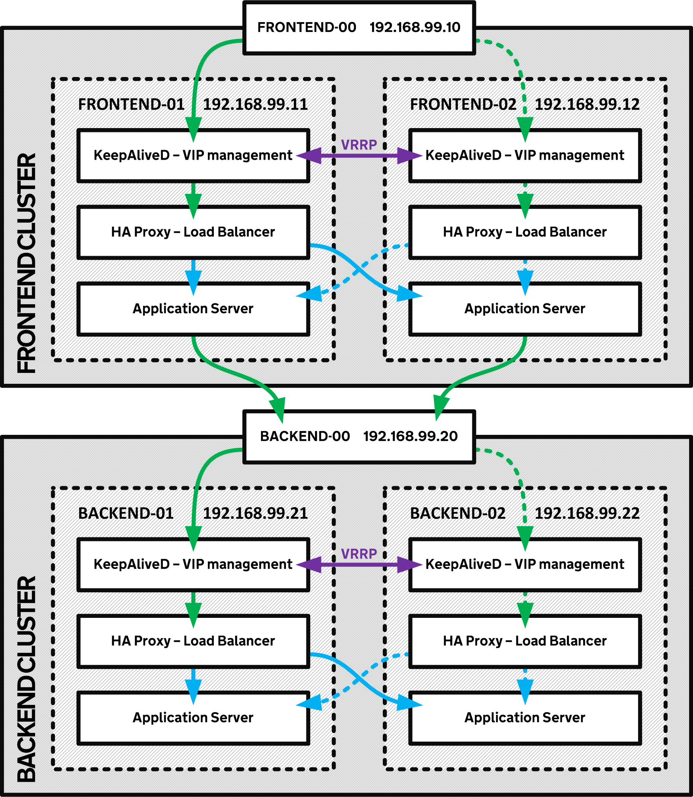

ha-demo
=======

#### Demonstration of High Availability web applications

This repository provides a simple demonstation of stateless WSGI applications being load balanced using [HA Proxy](http://www.haproxy.org/), with [KeepAliveD](http://www.keepalived.org/) used for VIP failover.

In this example there is a pair of frontend applications sitting behind a pair of load balancers, and a pair of backend applications sitting behind another pair of load balancers to demonstrate full stack load balancing.


### Configuration

Four CentOS 7 VMs are used to provide this example and each pair represents an individual cluster. Rather than use external load balancing, each cluster contains all necessary components to provide a high availability connection.

Each virtual IP is managed using [Virtual Router Redundancy Protocol](https://en.wikipedia.org/wiki/Virtual_Router_Redundancy_Protocol) in KeepAliveD. This ensures quick failover of the VIP in the event of a failure on the master node, allowing connections to resume reaching the cluster in ~1 second.

The primary method for distributing load to the application servers is through a HA Proxy load balancer configured to use an active:active round-robin balancing method to send requests to each application server. A health check is implemented in the configuration, resulting in a ~2 second failover in the event of a failure in one of the application servers.

KeepAliveD is configured to fail over the address if the HA Proxy load balancer is stopped for any reason, providing full fault tolerance for the load balancers, application servers, and the host machines.




## Requirements
- Vagrant >= 1.7.4
- Virtualbox >= 4.3.28
- 4GiB of free memory


## Instructions

Simply start Vagrant to provision the cluster. On my local machine this takes ~8m.
```
vagrant up
```

You can then reach the Frontend web service via http://192.168.99.10/.

You can also query the API via http://192.168.99.10/frontend:

```
curl http://192.168.99.10/frontend
{
  "backend": "backend-01",
  "frontend": "frontend-02"
}
```


## Testing the clusters

*Note: It is useful to run something similar to the following command to watch the cluster fail over correctly. This will get a new response every 2 seconds and allow an almost real-time view of the service state.*
```
$ watch curl -s http://192.168.99.10/frontend 2>/dev/null

Every 2.0s: curl -s http://192.168.99.10/frontend

{
  "backend": "backend-01",
  "frontend": "frontend-02"
}

```

You can test VIP failover in two ways; you can shutdown the VIP service itself, or the load balancer it points at.

**Stop KeepAliveD:**
```
sudo systemctl stop keepalived
```

**Stop HA Proxy:**
```
sudo systemctl stop haproxy
```

Either command should mean that the VIP fails over to the secondary node (`frontend-00` fails to `frontend-02`, `backend-00` fails to `backend-02`). You can see the log entries for VIP failover in `/var/log/messages`

To test that the load balancers correctly pick up a failing application server and only route requests to the healthy nodes in the cluster you can stop one of the application servers.

**Stop application server:**
```
sudo systemctl stop ha-demo
```

If the load balancer health checks are working correctly, all requests should be diverted to the other node.

You can check the current status of HA Proxy by visiting the admin pages at http://192.168.99.10:8080/ and http://192.168.99.20:8080/.

Starting the services again should restore full availability.
